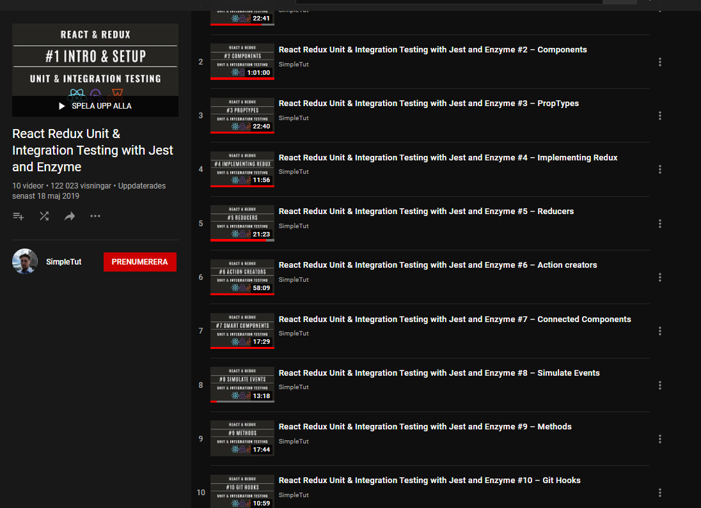

# React Redux Testing Template using Jest and Enzyme

The purpose of this project is to demonstrate how to properly implement a test first approch (TDD) to coding with react and redux.

Within this project you will find examples of testing:

* Connected and unconnected components
* Component state and Redux state
* Action creators and reducers
* Complex action creators that use Redux Thunk and Axios
* Action creators called from connected components"# bannanas" 


<div align="center">
</div>


<h4 align="center" >
  React Redux Unit & Integration Testing
</h4>

<div align = "center">

  
</div>


##
Modules:  {

```

jest 

enzyme

shallow

And much More
```
#
Status: Work In Progess ⌛


##
```
Author:  { Stephen Grider }
```


